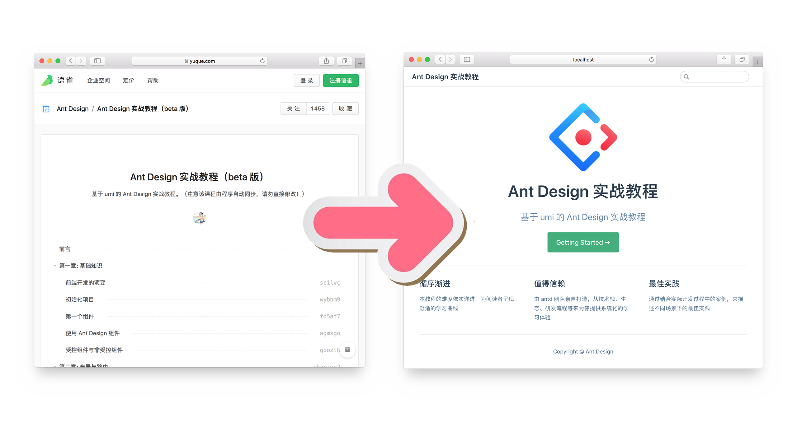

# vuepress-plugin-yuque

[](https://npmjs.com/package/vuepress-plugin-yuque) [](https://npmjs.com/package/vuepress-plugin-yuque) [](https://circleci.com/gh/ulivz/vuepress-plugin-yuque/tree/master) 

> 本插件需要 VuePress >= 1.0.0-alpha.37。



## 特性

- **简单**：Zero-Markdown，只需配置你的语雀 repo 地址，就能获得一个 VuePress 站点；
- **高效**：自动生成的文档主页、侧边栏让你享受 “高效” 的文档生成体验；
- **缓存**：完美地解决语雀 Open API 调用次数超限的问题；

想了解更多，请移步：

- **案例**
  - [视频演示](https://player.youku.com/embed/XNDA1MzAwMDIzNg==)
  - [**Site**](https://antd-course.ulivz.com/)
  - [语雀](https://www.yuque.com/ant-design/course)
  - [源码](https://github.com/ulivz/vuepress-plugin-yuque/tree/master/example/.vuepress)
- **文档**
  - [**Site**](https://vuepress-plugin-yuque.ulivz.com/)
  - [语雀](https://www.yuque.com/vuepress/vuepress-plugin-yuque)
  - [源码](https://github.com/ulivz/vuepress-plugin-yuque/tree/master/docs/.vuepress)

## 快速上手

```js
// .vuepress/config.js
module.exports = {
  title: 'Ant Design 实战教程',
  description: '基于 umi 的 Ant Design 实战教程',
  plugins: [
    ['vuepress-plugin-yuque', {
      repoUrl: 'https://www.yuque.com/ant-design/course',
    }]
  ]
}
```

你将获得：

1. 自动生成的主页
2. 根据语雀的目录自动生成的侧边栏
3. 自带的搜索
4. 自动生成的上一页/下一页


## Contributing

1. Fork it!
2. Create your feature branch: `git checkout -b my-new-feature`
3. Commit your changes: `git commit -am 'Add some feature'`
4. Push to the branch: `git push origin my-new-feature`
5. Submit a pull request :D


## Author

**vuepress-plugin-yuque** © [ULVIZ](https://github.com/ulivz), Released under the [MIT](./LICENSE) License.<br>
Authored and maintained by ULVIZ with help from contributors ([list](https://github.com/ulivz/vuepress-plugin-yuque/contributors)).

> [github.com/ulivz](https://github.com/ulivz) · GitHub [@ULVIZ](https://github.com/ulivz) · Twitter [@_ulivz](https://twitter.com/_ulivz)
